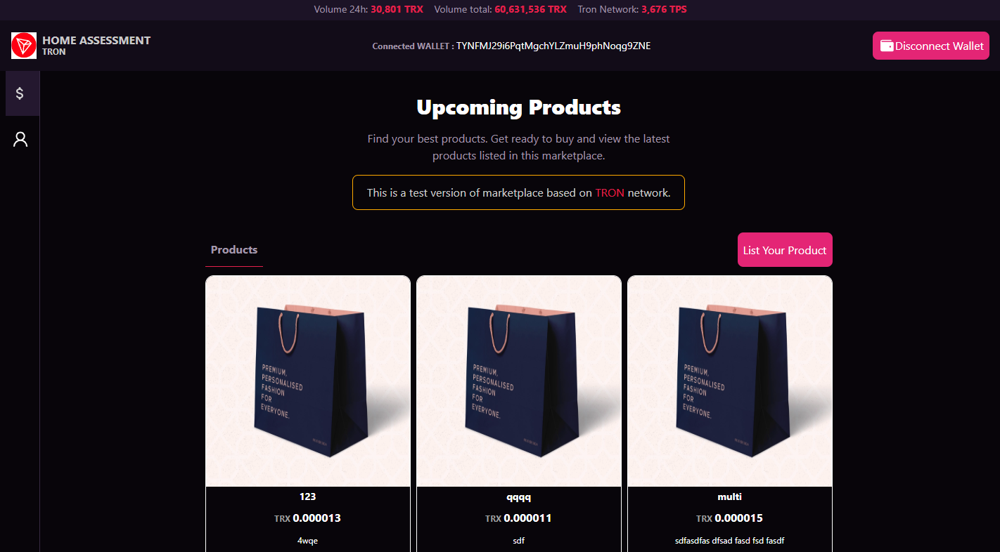

<a name="readme-top"></a>

<!-- PROJECT LOGO -->
<br />
<div align="center">
  <a href="/">
    
  </a>
    <h1 align="center">SIMPLE MARKETPLACE based on TRON</h1>
</div>

<!-- TABLE OF CONTENTS -->
<details>
  <ol>
    <li>
      <a href="#about-the-project">About The Project</a>
    </li>
    <li>
      <a href="#getting-started">Getting Started</a>
      <ul>
        <li><a href="#system-requirements">System Requirements</a></li>
        <li><a href="#installation">Installation</a></li>
      </ul>
    </li>
  </ol>
</details>

<!-- ABOUT THE PROJECT -->

## About The Project

This is a simple proof of implementation for tron based marketplace

This application is built with Solidity, React, Tailwind CSS.
The smart contracts is written by Solidity with tronbox deployed on nile testnet.
Tron link wallet and `@tronweb3/tronwallet-adapter-react-hooks` are used to get the job done.
Context is used to handle the global state management.

<!-- GETTING STARTED -->

## Getting Started

### System Requirements

- [NodeJS][node] v14 or greater
- [npm][npm] v6 or greater
- [tronbox][solc] v0.8.18

To verify things are set up
properly, you can run this:

```shell
node --version
npm --version
tronbox
```

### Installation

- Frontend

```js
npm install
```

- Smart Contracts

```js
npm install
npm install tronbox -g
tronbox --download-compiler 0.8.18
```

### Build and Deploy

- Frontend

```js
npm run build
```

- Smart Contracts

```js
  tronbox compile
  tronbox migrate --network nile
```

The verified smart contracts tracking url is
https://nile.tronscan.org/#/contract/TDgGM4t5RFL4obFHht8fcsED299m8huywA/code

### Run

- Frontend

```js
npm run start
```

## Implementation

- List product with name, description, price and image (Images are uploaded to IPFS using Pinata).
- Purchase products by sending TRX to owner.
- Transfer ownership without sending TRX.
- Withdraw transaction fees from smart contracts to marketplace owner.
- Calculate platform fee (default: 5%).
- Update platform fee by only owner.

## Upgradeable

- All digital assets can be tokenized using TRC721 to enhance the ownership and security.
- To implement combination of on-chain and off-chain functionality, we can build backend server and database.
- In frontend, we can apply customized CART and checkout pages to ensure better UX.

<br/>
<hr/>
<i>Abrahan Gerardo Marcano Rios 05/15/2023</i>
